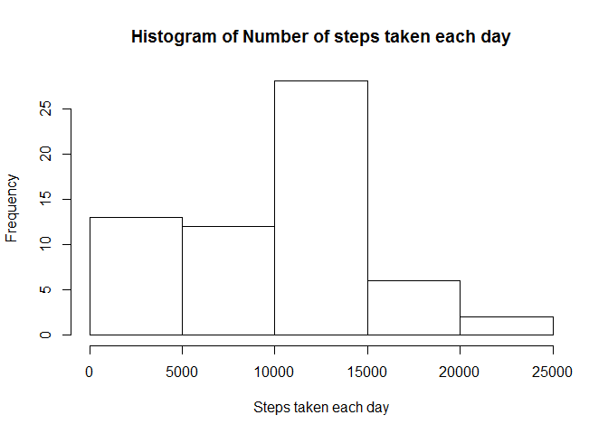
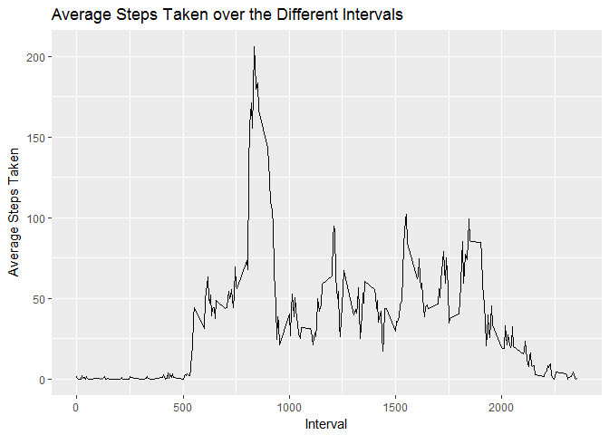
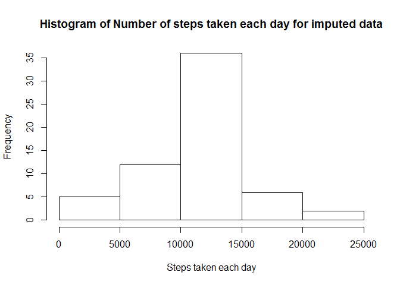
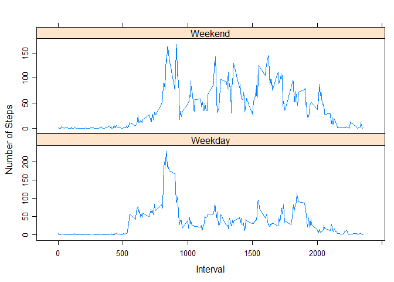

1. Loading and preprocessing the data
==============================================================================

Loading the dataset..


```r
options(scipen=999)
setwd("C:/Users/abaokar/DataScience/Course 5 - Reproducible Research/Week 2/Data/")
library(tidyverse)
```

```
## -- Attaching packages ------------------------------------------------------- tidyverse 1.2.1 --
```

```
## v ggplot2 2.2.1     v purrr   0.2.4
## v tibble  1.4.2     v dplyr   0.7.4
## v tidyr   0.8.0     v stringr 1.3.0
## v readr   1.1.1     v forcats 0.3.0
```

```
## -- Conflicts ---------------------------------------------------------- tidyverse_conflicts() --
## x dplyr::filter() masks stats::filter()
## x dplyr::lag()    masks stats::lag()
```

```r
library(lattice)
activity <- rio::import("activity.csv")
```

2. What is mean total number of steps taken per day?
===============================================================================

1 Ignoring the missing values in the dataset, the below code and results are to form a dataset "activity_day", which has steps aggregated on daily basis. 


```r
activity_day <- activity %>% group_by(date) %>% summarise(sum_steps = sum(steps, na.rm = TRUE))
```
2 The code below produces histogram of number of steps take per day and, reports the mean and median for the dataset.


```r
hist(activity_day$sum_steps, main = "Histogram of Number of steps taken each day",
     xlab = "Steps taken each day")
```

<!-- -->

```r
mean_day <- round(mean(activity_day$sum_steps, na.rm = TRUE),0)
median_day <- median(activity_day$sum_steps, na.rm = TRUE)
```

The mean and meadian for the total number of steps taken per day are 9354 and 10395 respectively.

3. What is the average daily activity pattern?
=======================================================================

1 The code for creating the time serier plot by interval is below. Also the plots are shown.


```r
activity_interval <- activity %>% group_by(interval) %>% summarise(mean_steps = mean(steps, na.rm = TRUE))

ggplot(activity_interval, aes(interval, mean_steps)) + geom_line() + xlab("Interval") +
  ylab("Average Steps Taken") + ggtitle("Average Steps Taken over the Different Intervals")
```

<!-- -->

2 Code to calculate the interval corresponding to maximum number of steps

```r
max_interval_steps <- (activity_interval %>% filter(mean_steps == max(mean_steps)))$interval
```

the 5-minute interval for which the maximum steps were taken is 835

4. Imputing missing values
========================================================================

1 Calculating and Reporting the total number of missing values in the dataset.


```r
activity_w_na <- activity %>% filter(is.na(steps))
total_na <- nrow(activity_w_na)
```
The total number of missing rows in the dataset is 2304

2 imputing the missing values with the average steps taken per interval.


```r
activity_wo_na <- activity %>% filter(!is.na(steps))
activity_interval_wo_na <- activity_wo_na %>% group_by(interval) %>% 
                          summarise(mean_steps = mean(steps, na.rm = TRUE))

activity_imputed <- activity_w_na %>% left_join(activity_interval_wo_na, by = "interval") %>% 
                    mutate(steps = round(mean_steps,0)) %>% select(-mean_steps)

activity_imputed <- rbind(activity_imputed, activity_wo_na) %>% arrange(date)
```

3 Creating the histogram of steps taken per day and calculating the mean and median of the imputed dataset


```r
activity_imputed_day <- activity_imputed %>% group_by(date) %>% summarise(sum_steps = sum(steps, na.rm = TRUE))
hist(activity_imputed_day$sum_steps, main = "Histogram of Number of steps taken each day for imputed data",
     xlab = "Steps taken each day")
```

<!-- -->

```r
mean_imputed_day <- round(mean(activity_imputed_day$sum_steps, na.rm = TRUE), 0)

median_imputed_day <- median(activity_imputed_day$sum_steps, na.rm = TRUE)
```
The mean and meadian for the total number of steps taken per day for the imputed dataset are 10766 and 10762 respectively. These values differ from the values calculated on non-imputed dataset. 

After imputing the mean and the median both have increased.

5. Are there differences in activity patterns between weekdays and weekends?
=================================================================================

Checking if there are any differences in the activity pattern on weekdays and weekends. This analysis is based on the 5-minute interval variable. The plot has been created by creating dataset containing the average number of steps taken, averaged across all weekday days or weekend days 


```r
activity1 <- activity_imputed %>% mutate(weekdays = weekdays(as.Date(date))) %>%
              mutate(week_weekend = ifelse(weekdays == "Saturday" | weekdays == "Sunday",
                                           "Weekend", "Weekday"))
activity1 <- activity1 %>% group_by(week_weekend, interval) %>% 
              summarise(mean_steps = mean(steps, na.rm = TRUE))

activity1 <- transform(activity1, week_weekend = factor(week_weekend))


xyplot(mean_steps~interval|week_weekend,data=activity1,type="l", xlab = "Interval", ylab = "Number of Steps",
       scales=list(y=list(relation="free")),
       layout=c(1,2))
```

<!-- -->

The above plot shows that there is increased activity on weekends as compared to weekdays.
